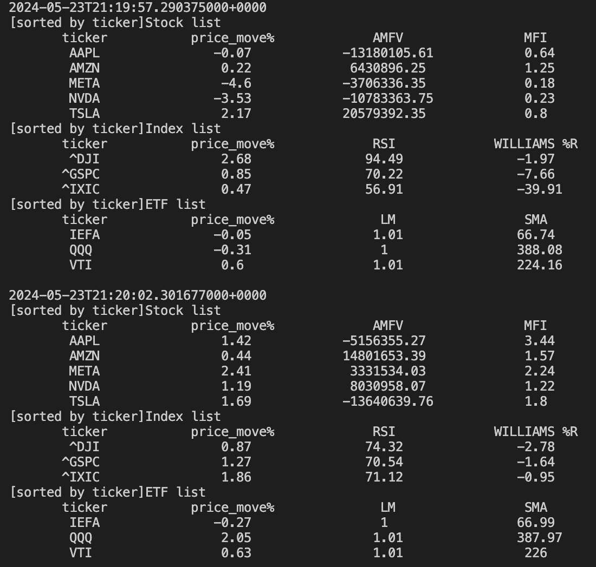

# Real-time Algorithmic Trading Environment

Out of my personal interest in stock market and high-performing program, I built a real-time algorithmic trading environment in C++20 that mimics live data-streaming inputs and calculates the technical indicators (alphas) using each asset's price data every certain amount of time, the calculated asset list is displayed to the user in terms of assets' alphas. Future leverage of the results is to be fed to certain well-researched thresholds that conduct automatic trading. The asset classes I supported are equity, index, and ETF. The data in this project came from Yahoo Finance's open-source asset price data, and I used a producer thread to produce and feed data that mimics live streaming from exchanges.

After compiling through the mainpoint `env.cpp`, the user is expected to see dynamically updated output on screen every pre-defined amount of time (5s in my case), which is the timeframe over which the data is streamed, and the output contains all assets' alphas calculated over that period. The output list can be either sorted by ticker lexigraphcally ascending or by price movement(%) descending using the constexpr mode variables `view_list_by_ticker` and `view_list_by_price_move` in `env.cpp`. An example output format is as follows: (which is updated every 5s)

Further leverages: As mentioned above, the calculated asset alphas over each period can be used to conduct automatic trading based on some well-researched thresholds, obviously depending on which alpha it is as well. At the same time, we can report the trading activities over each such period to the user output. We can expect automatic long or short for an asset(s), dynamically updating over time.

The projects uses a multi-stages producer-consumer environment protocol, aka a data generating thread, a data processing thread, and a printing thread, which is suggested by Professor Mike Spertus at University of Chicago. The primary goal of this project serves as the course assessment in Advanced C++ master's course taught by Professor Mike Spertus at University of Chicago, which also pertaining to my personal interest and I enjoy greatly doing it. Some implementation details also received precious feedback from Mike over his office hours. The project was spoken highly of by Mike when it was completely finished.
